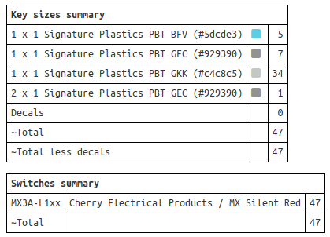
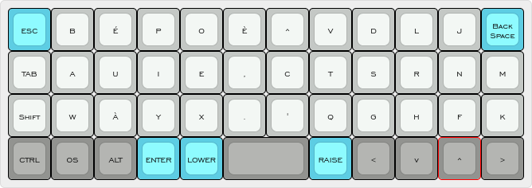
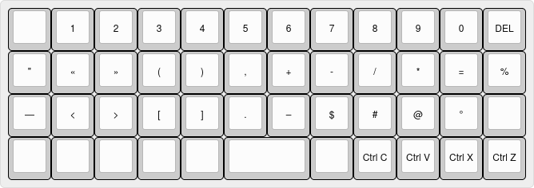
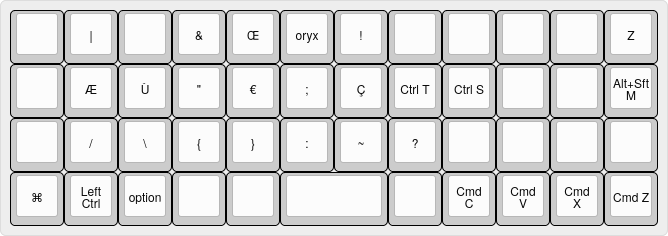

# Clavier

## BÉPO PLANCK EZ + DSA QUARTZ (PMK)

## Caractéristiques
Profile DSA *QUARTZ* (Signature plastics)

### Couche initiale

### Couche inférieure

### Couche supérieure

    

## Sources
[Éditeur de disposition de clavier : www.keyboard-layout-editor.com](http://www.keyboard-layout-editor.com/)

[Disposition de clavier : drop.com](https://drop.com/talk/947/physical-keyboard-layouts-explained-in-detail)

[Signature plastics DSA QUARTZ](https://pimpmykeyboard.com/dsa-quartz-keyset-sublimated/)

[ERGODOX Planck](https://ergodox-ez.com/pages/planck)

[OLKB Planck](https://olkb.com/collections/planck)

[Configurateur QMK](https://config.qmk.fm/#/planck/rev6/LAYOUT_ortho_4x12)

[Configurateur ZSA](https://configure.zsa.io/planck-ez/layouts/default/latest/0)